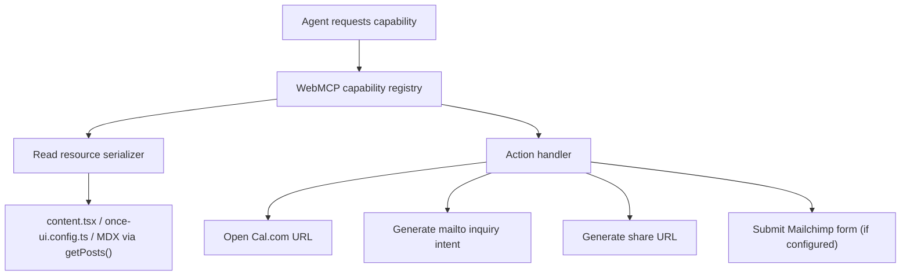

# feat: Add WebMCP agent access surface

## Overview

Add a WebMCP layer to `ryanlisse.com` so external agents and visitors using their own agents can interact with the site through structured capabilities instead of scraping DOM. The first release should expose public read access for the portfolio's core entities and public high-value actions that the site already exposes or clearly implies: booking, contact/inquiry intent, newsletter signup when configured, and shareable public links.

This plan carries forward the brainstorm's chosen direction: invisible infrastructure only, no dedicated `/agent` page in v1, no attempt at full UI parity, and existing file-backed content remains the source of truth (see brainstorm: `docs/brainstorms/2026-03-01-webmcp-agent-access-brainstorm.md`).

## Problem Statement

The site currently works well for human visitors, but agents must infer structure from rendered pages and untyped links:

- Portfolio entities live in multiple sources:
  - `src/resources/content.tsx`
  - `src/app/work/projects/*.mdx`
  - `src/app/blog/posts/*.mdx`
- Listing and detail pages render that content for humans, but there is no agent-facing capability surface.
- High-value actions exist only as ordinary links or HTML forms:
  - booking via Cal.com links in `src/app/page.tsx`, `src/app/services/page.tsx`, and `src/app/work/page.tsx`
  - contact via `mailto:` links in `src/resources/content.tsx`, `src/components/Footer.tsx`, and `src/components/Header.tsx`
  - sharing via URL generation and clipboard UI in `src/components/blog/ShareSection.tsx`
  - newsletter via `src/components/Mailchimp.tsx`, although `newsletter.display` is `false` and `mailchimp.action` is currently empty in `src/resources/content.tsx` and `src/resources/once-ui.config.ts`

Without a structured surface, external agents cannot reliably:

- discover the site map and content inventory
- compare services, projects, and blog posts
- identify contact and booking routes without DOM scraping
- trigger commercial actions in a way that is explicit, auditable, and stable

## Proposed Solution

Implement a WebMCP integration layer that publishes:

1. A public read surface for routes, profile/about data, services, projects, blog posts, and contact methods.
2. A public action surface for commercial and sharing flows that matter in practice:
   - `book_call`
   - `start_inquiry`
   - `share_content`
   - `subscribe_newsletter` only when Mailchimp is configured and the newsletter is intentionally enabled
3. A thin translation layer from existing site data into WebMCP resource/action descriptors, without introducing a second content store.

This follows the brainstorm's recommended Approach C and explicitly rejects:

- read-only WebMCP, because launch success requires both structured discovery and commercial action flow support (see brainstorm: `docs/brainstorms/2026-03-01-webmcp-agent-access-brainstorm.md`)
- full UI parity, because low-value controls like theme toggles and protected-route auth do not materially improve the portfolio use case (see brainstorm: `docs/brainstorms/2026-03-01-webmcp-agent-access-brainstorm.md`)

## Technical Approach

### Architecture

Create a small WebMCP adapter in the Next.js app with three responsibilities:

1. **Read the current source-of-truth content**
   - Use existing config and MDX loaders instead of duplicating data.
   - Reuse `getPosts()` from `src/utils/utils.ts` for blog and project inventory.
   - Reuse typed content exports from `src/resources/content.tsx` and route config from `src/resources/once-ui.config.ts`.

2. **Normalize content into agent-facing primitives**
   - Prefer primitive read capabilities over workflow tools.
   - Example read capabilities:
     - `list_routes`
     - `get_profile`
     - `list_services`
     - `list_projects`
     - `get_project`
     - `list_posts`
     - `get_post`
     - `list_contact_methods`
   - Example action capabilities:
     - `book_call`
     - `start_inquiry`
     - `share_content`
     - `subscribe_newsletter` when enabled and configured

3. **Expose WebMCP metadata and handlers using Chrome's preview model**
   - Use the official Chrome WebMCP preview as the source of truth for v1 semantics.
   - Support both declarative form-style actions and imperative JS actions where necessary.
   - Keep the integration additive so the site remains fully functional for humans without WebMCP consumers.

### Proposed File/Module Shape

Target structure:

```text
src/lib/webmcp/
  capabilities.ts          # Capability registry and metadata
  resources.ts             # Read models derived from existing content
  actions.ts               # Action descriptors and handlers
  serializers.ts           # Stable JSON payload shaping
  guards.ts                # Config and abuse-prevention checks

src/app/
  layout.tsx               # WebMCP bootstrap/registration entrypoint
  api/webmcp/...           # Optional fallback HTTP endpoints if required by preview API
```

Representative pseudo-interfaces:

```ts
// src/lib/webmcp/resources.ts
export type WebMcpRouteResource = {
  id: string;
  path: string;
  title: string;
  description: string;
  type: "route" | "service" | "project" | "post" | "profile";
};

export function listProjectsResource(): WebMcpRouteResource[] {}
export function getProjectResource(slug: string): WebMcpRouteResource | null {}

// src/lib/webmcp/actions.ts
export type WebMcpActionResult = {
  kind: "open_url" | "submit_form" | "copyable_link";
  url?: string;
  method?: "GET" | "POST";
  fields?: Record<string, string>;
  message?: string;
};

export function bookCallAction(): WebMcpActionResult {}
export function startInquiryAction(input: { subject?: string; contextUrl?: string }): WebMcpActionResult {}
export function shareContentAction(input: { url: string; platform: "x" | "linkedin" | "email" | "copy" }): WebMcpActionResult {}
```

### Resource Modeling

Map the site's current entities into stable agent-readable records:

- **Profile/About**
  - `person`, `about.intro`, social links, location, languages, booking link
- **Services**
  - top-level services route metadata from `content.tsx`
  - service tier cards rendered in `src/app/services/page.tsx`
- **Projects**
  - MDX frontmatter plus summary and canonical route from `src/app/work/projects/*.mdx`
- **Blog posts**
  - MDX frontmatter plus summary and canonical route from `src/app/blog/posts/*.mdx`
- **Routes**
  - enabled routes from `src/resources/once-ui.config.ts`
- **Contact methods**
  - Cal.com, email, LinkedIn, GitHub, and any future inquiry endpoint

Important constraint: content normalization must be deterministic and derived from the same data the UI already uses (see brainstorm: `docs/brainstorms/2026-03-01-webmcp-agent-access-brainstorm.md`).

### Action Modeling

V1 action scope should align with what the site actually exposes today.

#### `book_call`

- Returns a structured open action for `https://cal.com/ryan-lisse/30min`
- May include human-readable title and expected duration metadata if available
- Should be available anywhere the site would reasonably recommend booking

#### `start_inquiry`

- Do not invent a hidden CRM or separate database for v1.
- Preferred v1 implementation:
  - produce a structured `mailto:` intent using `person.email`
  - optionally include subject/body scaffolding with page context, selected service, or project reference
- Optional enhancement:
  - replace or supplement with a lightweight public inquiry endpoint later if spam handling and storage requirements justify it

#### `share_content`

- Expose URL generation as a structured action for public content.
- Avoid agent-only clipboard semantics in the core contract.
- Translate to:
  - `copyable_link`
  - X share URL
  - LinkedIn share URL
  - email share URL
- Use the same platform rules already encoded in `src/components/blog/ShareSection.tsx`

#### `subscribe_newsletter`

- Gate this capability on real configuration, not intent.
- Capability is enabled only if all are true:
  - `newsletter.display === true`
  - `mailchimp.action` is non-empty
  - required form fields are known and valid
- If configuration is incomplete, omit this capability from the published WebMCP surface and document why.

### Anti-Abuse and Public Access Controls

The brainstorm intentionally moved from gated actions to public actions. That means the plan must include explicit abuse controls rather than assuming benevolent consumers.

Minimum protections for v1:

- rate limiting on any server-handled action endpoint
- bot/spam mitigation for any future inquiry endpoint
- no secret-bearing action contracts exposed to the client
- clear allowlist of public actions; do not accidentally expose internal or admin-only flows
- analytics/logging for action invocation volume and failures
- graceful fallback when WebMCP is unavailable or unsupported

### Registration Strategy

Because WebMCP is still preview-stage, implementation should be staged:

1. Add a capability assembly layer under `src/lib/webmcp/`.
2. Add a small client bootstrap in `src/app/layout.tsx` or a dedicated client component responsible for WebMCP registration.
3. Keep all registration logic isolated so API churn in the preview does not spread across route/page components.

## Implementation Phases

### Phase 1: Foundation and Preview Validation

Deliverables:

- Confirm the latest Chrome WebMCP preview API and required browser-side registration shape.
- Create `src/lib/webmcp/` with typed capability/resource/action models.
- Add config guards for feature enablement and newsletter availability.
- Document preview-only assumptions and fallback behavior.

Success criteria:

- A local feature flag or capability toggle can enable/disable WebMCP without affecting normal site rendering.
- Capability assembly works against existing content sources without duplicating data.

Estimated effort: 0.5-1 day

### Phase 2: Public Read Surface

Deliverables:

- Implement normalized read resources for:
  - routes
  - profile/about
  - services
  - projects
  - blog posts
  - contact methods
- Ensure canonical URLs and summaries match current page metadata.
- Add serialization tests to prevent schema drift.

Success criteria:

- Agents can discover and inspect the full public portfolio surface without scraping rendered DOM.
- Read results match the content currently rendered on `/`, `/about`, `/services`, `/work`, and `/blog`.

Estimated effort: 1-2 days

### Phase 3: Public Action Surface

Deliverables:

- Implement `book_call`
- Implement `start_inquiry`
- Implement `share_content`
- Implement `subscribe_newsletter` only when configured
- Add telemetry/logging around action success/failure

Success criteria:

- Action descriptors reliably open or submit the same public flows humans can use today.
- Unsupported or disabled actions are omitted rather than returning misleading no-op capabilities.

Estimated effort: 1-2 days

### Phase 4: Verification, Rollout, and Documentation

Deliverables:

- Cross-browser sanity check with supported Chrome/WebMCP preview environment
- Regression testing for existing human flows
- Update documentation for capability inventory, configuration requirements, and known preview constraints

Success criteria:

- Human UX remains unchanged
- WebMCP capability inventory is documented for future maintenance
- Failures degrade safely and visibly in logs

Estimated effort: 0.5-1 day

## Alternative Approaches Considered

### Approach A: Read-only WebMCP

Rejected because launch success requires both structured content discovery and commercial intent flows. Read-only would improve discoverability but fail the brainstorm's release criteria (see brainstorm: `docs/brainstorms/2026-03-01-webmcp-agent-access-brainstorm.md`).

### Approach B: Full UI parity

Rejected because it would overfit the site's low-value UI details and pull the implementation toward theme toggles, route auth, and incidental controls. That adds complexity without improving the commercial portfolio use case (see brainstorm: `docs/brainstorms/2026-03-01-webmcp-agent-access-brainstorm.md`).

### Approach C: Public read + high-value public actions

Chosen because it is the smallest surface that satisfies both discovery and action success criteria while staying aligned with the site's real role as a portfolio and services site (see brainstorm: `docs/brainstorms/2026-03-01-webmcp-agent-access-brainstorm.md`).

## System-Wide Impact

### Interaction Graph



Action-specific propagation:

- `book_call` triggers capability lookup, then returns/open-links Cal.com.
- `start_inquiry` triggers capability lookup, then constructs a prefilled email or future inquiry payload.
- `share_content` triggers capability lookup, then reuses the same URL-generation rules encoded in the share UI.
- `subscribe_newsletter` triggers capability lookup, then either submits the Mailchimp form contract or is omitted entirely when disabled.

### Error & Failure Propagation

Expected failure classes:

- preview API unavailable or changed
- malformed capability payload
- missing content source data
- invalid slug or canonical URL mismatch
- third-party destination issues:
  - Cal.com unavailable
  - Mailchimp action misconfigured
  - social share endpoint format drift

Handling requirements:

- registration failures must not break page rendering
- malformed capability generation should fail closed for the affected capability only
- action invocation failures should return explicit error payloads or safe omission, not silent success
- logs should identify which capability failed and why

### State Lifecycle Risks

This feature should remain nearly stateless in v1.

- Read resources are derived at runtime from existing content.
- `book_call` and `share_content` return URLs and should not persist new application state.
- `start_inquiry` can remain stateless if implemented as `mailto:`.
- `subscribe_newsletter` delegates state to Mailchimp if enabled.

Primary lifecycle risk:

- introducing a new inquiry store or hidden server-side side effects prematurely. Avoid that in v1 unless business requirements become more explicit.

### API Surface Parity

Existing public interfaces affected:

- page navigation and metadata for `/`, `/about`, `/services`, `/work`, `/blog`
- blog/project detail route generation from MDX slugs
- Cal.com CTA links
- social share URLs
- newsletter form contract

Parity requirement:

- if the UI can present a project/post/service or actionable public contact method, the WebMCP surface should expose an equivalent structured representation unless explicitly out of scope
- low-value UI controls remain intentionally excluded in v1:
  - theme toggle
  - password auth / protected routes

### Integration Test Scenarios

Cross-layer scenarios that matter:

1. Capability registry returns the same number of posts/projects as the UI list pages render.
2. A project or post slug added in MDX automatically appears in both the UI and the WebMCP read surface without extra registration work.
3. Disabling newsletter display or leaving `mailchimp.action` empty removes `subscribe_newsletter` from WebMCP without breaking `/blog`.
4. `book_call` always resolves to the same Cal.com destination used by visible CTA buttons.
5. `share_content` generates platform URLs identical to the current share UI for the same canonical post URL.

## Acceptance Criteria

### Functional Requirements

- [x] WebMCP capability registration is added without changing the site's visible IA or adding a dedicated `/agent` page.
- [x] Agents can read structured public data for profile/about, services, projects, blog posts, routes, and contact methods.
- [x] Structured read results come from existing content sources, not a second content store.
- [x] Agents can trigger `book_call` as a structured public action.
- [x] Agents can trigger `start_inquiry` as a structured public action aligned with current contact methods.
- [x] Agents can trigger `share_content` for public URLs.
- [x] `subscribe_newsletter` is available only when newsletter config is intentionally enabled and complete.
- [x] Out-of-scope controls are not exposed in v1: theme toggle, protected-route auth, and other incidental UI-only behaviors.

### Non-Functional Requirements

- [x] Human browsing behavior remains unchanged when WebMCP is present or absent.
- [x] Registration or capability failures do not crash page render.
- [x] Public action handling includes basic abuse controls where the site processes requests directly.
- [x] Capability payloads are deterministic and type-checked.

### Quality Gates

- [x] Unit tests cover resource normalization and action serialization.
- [x] Integration tests cover capability/UI parity for posts, projects, and services.
- [ ] Manual verification is performed in a supported Chrome/WebMCP preview environment.
- [x] Documentation explains feature flagging, capability inventory, and newsletter configuration rules.

## Success Metrics

- Agents can answer portfolio comparison questions using structured site data rather than DOM scraping.
- Agents can initiate booking/contact/share flows from the structured capability layer.
- Newly added MDX posts and projects appear automatically in the read surface.
- No regression in existing homepage, services, work, blog, or contact CTA behavior.

## Dependencies & Prerequisites

- Chrome WebMCP preview support and current API documentation
- Next.js 16 runtime compatibility
- Existing MDX content loaders in `src/utils/utils.ts`
- Existing content/config exports in `src/resources/content.tsx` and `src/resources/once-ui.config.ts`
- Mailchimp configuration if newsletter signup is intended to ship in v1

## Risk Analysis & Mitigation

| Risk | Impact | Mitigation |
|------|--------|------------|
| WebMCP preview API changes before or during implementation | Medium-High | Isolate registration/bootstrap logic in one module and keep page components unaware of preview details |
| Newsletter remains disabled or misconfigured | Medium | Treat newsletter capability as optional and omit it unless config is valid |
| Public action abuse on any server-handled endpoint | High | Rate limit, validate inputs, and prefer stateless redirect/url-generation flows in v1 |
| Capability drift from UI content | Medium | Derive capabilities from the same content/config sources and add parity tests |
| Overbuilding into a second content system | Medium | Reuse existing content modules and explicitly ban parallel content stores in v1 |

## Resource Requirements

- One engineer comfortable with Next.js/TypeScript and browser integration details
- Access to supported Chrome/WebMCP preview environment for manual validation
- Optional Mailchimp and Cal.com account validation during rollout

## Future Considerations

- Add richer comparison/query capabilities once the primitive surface is stable
- Add explicit inquiry capture endpoint only if lead handling requirements justify it
- Consider a visible “agent-ready” affordance later if usage warrants discoverability
- Revisit broader action parity only if the site becomes a true agent product rather than an agent-accessible portfolio

## Documentation Plan

Update or create:

- `docs/plans/2026-03-01-feat-webmcp-agent-access-surface-plan.md`
- implementation notes in a future solution doc after rollout
- inline module documentation for capability registry and config guards
- PR description notes covering preview constraints and manual verification steps

## Research Consolidation

### Internal Findings

- Current content sources:
  - `src/resources/content.tsx`
  - `src/resources/once-ui.config.ts`
  - `src/utils/utils.ts`
  - `src/app/work/projects/*.mdx`
  - `src/app/blog/posts/*.mdx`
- Current public action surfaces:
  - booking CTA buttons in `src/app/page.tsx`, `src/app/services/page.tsx`, `src/app/work/page.tsx`
  - contact email links in `src/resources/content.tsx`
  - share URL generation in `src/components/blog/ShareSection.tsx`
  - newsletter form in `src/components/Mailchimp.tsx`
- Institutional learnings:
  - no relevant `docs/solutions/` entries exist for WebMCP or similar agent-surface work in this repo as of 2026-03-01
- Related work:
  - PR #1 (`feat: reposition site for fractional AI engineering`) already established `/services` and the commercial CTA structure that WebMCP should expose

### External Findings

- Chrome announced the WebMCP early preview on 2026-02-10 and positions it around structured browser-agent interaction rather than DOM scraping.
- The preview explicitly describes two integration styles:
  - declarative form actions
  - imperative JavaScript actions
- This makes an adapter/registry layer the correct design choice for the site, because preview API details are still unstable.

## Sources & References

### Origin

- **Brainstorm document:** `docs/brainstorms/2026-03-01-webmcp-agent-access-brainstorm.md`
  - Key decisions carried forward:
    - invisible infrastructure only in v1
    - public read plus high-value public actions
    - no full UI parity
    - existing file-backed content remains the source of truth

### Internal References

- `src/resources/content.tsx`
- `src/resources/once-ui.config.ts`
- `src/utils/utils.ts`
- `src/components/Mailchimp.tsx`
- `src/components/blog/ShareSection.tsx`
- `src/app/page.tsx`
- `src/app/services/page.tsx`
- `src/app/work/page.tsx`
- `src/app/blog/[slug]/page.tsx`
- `src/app/work/[slug]/page.tsx`

### External References

- Chrome Developers: WebMCP early preview announcement
  - https://developer.chrome.com/blog/webmcp-epp
- WebMCP package/repository discovery
  - https://github.com/chromium/webmcp

## Ready-to-Start Checklist

- [x] Confirm latest WebMCP preview API details before coding
- [x] Decide feature flag name and default state
- [x] Confirm whether newsletter should remain omitted in v1 or be configured before rollout
- [x] Implement read capability registry before action handlers
- [x] Add capability/UI parity tests before rollout
