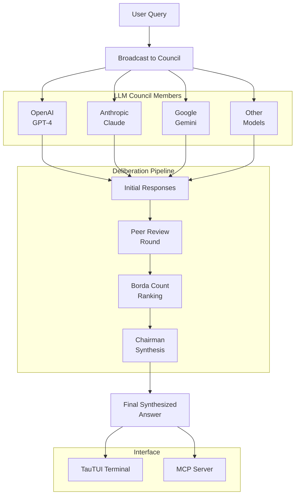

## Overview

Quorum is an LLM Council deliberation system that leverages multiple AI models to produce higher-quality, more thoughtful responses through structured deliberation, peer review, and Borda count ranking. Think of it as a panel of AI experts debating to find the best answer.

### Architecture

## The Problem

Single-model AI responses can be inconsistent, biased, or miss important perspectives. By combining multiple models in a structured deliberation process, we can achieve more nuanced and reliable outputs.

## Key Features

- **Multi-Model Deliberation**: Orchestrates responses from multiple LLM providers (OpenAI, Anthropic, Google, etc.) in a council format
- **Peer Review System**: Each model reviews and critiques other models' responses, improving overall quality
- **Borda Count Ranking**: Democratic ranking system to determine the best response based on collective evaluation
- **Chairman Synthesis**: A designated model synthesizes the top responses into a final, comprehensive answer
- **Swift CLI + TUI**: Beautiful terminal user interface built with TauTUI for interactive deliberations
- **MCP Integration**: Full Model Context Protocol support for AI assistant integration

## Technologies Used

- **Swift**: Core application and CLI implementation
- **TauTUI**: Terminal user interface framework for rich interactions
- **MCP SDK**: Model Context Protocol integration for AI tool access
- **Multiple LLM APIs**: OpenAI, Anthropic, Google AI, and more

## Architecture

The system follows a multi-stage pipeline:

1. **Query Broadcast**: User query sent to all council members
2. **Initial Responses**: Each model generates its response independently
3. **Peer Review Round**: Models review each other's responses
4. **Borda Ranking**: Votes tallied using Borda count method
5. **Chairman Synthesis**: Top responses synthesized into final answer

## Outcome

Quorum demonstrates that structured multi-model deliberation can produce responses that are more thoughtful, balanced, and accurate than single-model outputs. It's particularly effective for complex questions requiring multiple perspectives.
