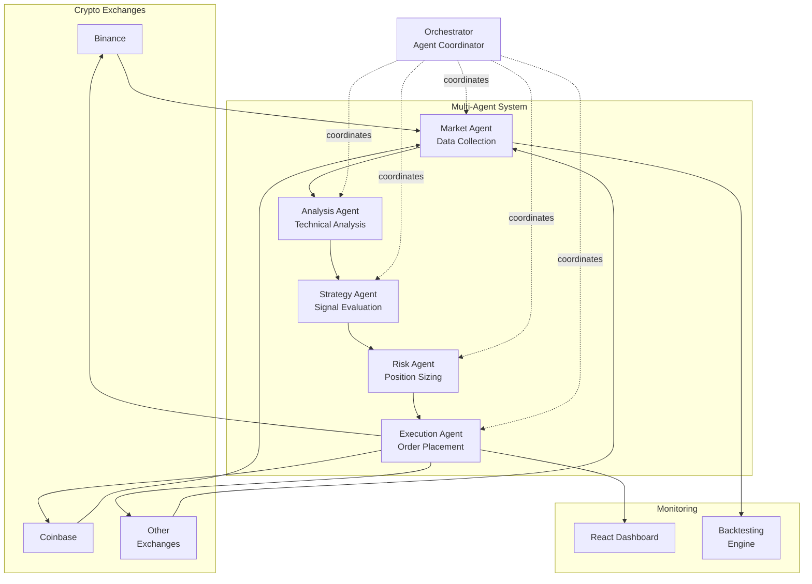

## Overview

Stellar Hypernova is a sophisticated cryptocurrency trading bot that uses multi-agent orchestration to analyze markets, identify opportunities, and execute trades automatically. Five specialized agents—market, analysis, strategy, risk, and execution—work together under an orchestrator to make informed trading decisions 24/7.

### Architecture

## The Problem

Cryptocurrency markets operate 24/7 and move fast. Manual trading is time-consuming and emotionally draining. Automated systems can monitor markets continuously and execute strategies consistently without fatigue or emotion.

## Key Features

- **Multi-Agent Architecture**: Specialized agents for analysis, strategy, risk management, and execution
- **Real-Time Market Data**: Continuous streaming of price data and market indicators
- **Technical Analysis**: Automated chart pattern recognition and indicator calculations
- **Risk Management**: Position sizing, stop-losses, and portfolio balancing
- **Backtesting Engine**: Test strategies against historical data before live trading
- **Dashboard UI**: Real-time monitoring and control interface

## Technologies Used

- **TypeScript**: Core application logic and type safety
- **Encore**: Backend infrastructure and API framework
- **Vite**: Fast frontend build tooling
- **React**: Dashboard and monitoring interface
- **Various Exchange APIs**: Binance, Coinbase, etc.

## Architecture

The system uses a multi-agent approach:

1. **Market Agent**: Collects and normalizes data from multiple exchanges
2. **Analysis Agent**: Performs technical analysis and pattern recognition
3. **Strategy Agent**: Evaluates signals and generates trade recommendations
4. **Risk Agent**: Assesses position sizing and portfolio exposure
5. **Execution Agent**: Places orders and manages active positions
6. **Orchestrator**: Coordinates all agents and handles communication

## Key Considerations

- **Risk Disclaimer**: Cryptocurrency trading involves significant risk
- **Paper Trading**: Extensive paper trading recommended before live deployment
- **Continuous Monitoring**: System requires oversight despite automation

## Outcome

Stellar Hypernova demonstrates how multi-agent systems can tackle complex, real-time decision-making problems. The modular architecture allows each component to be improved independently.
